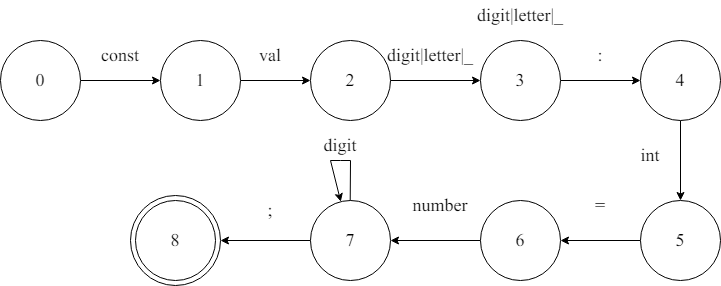
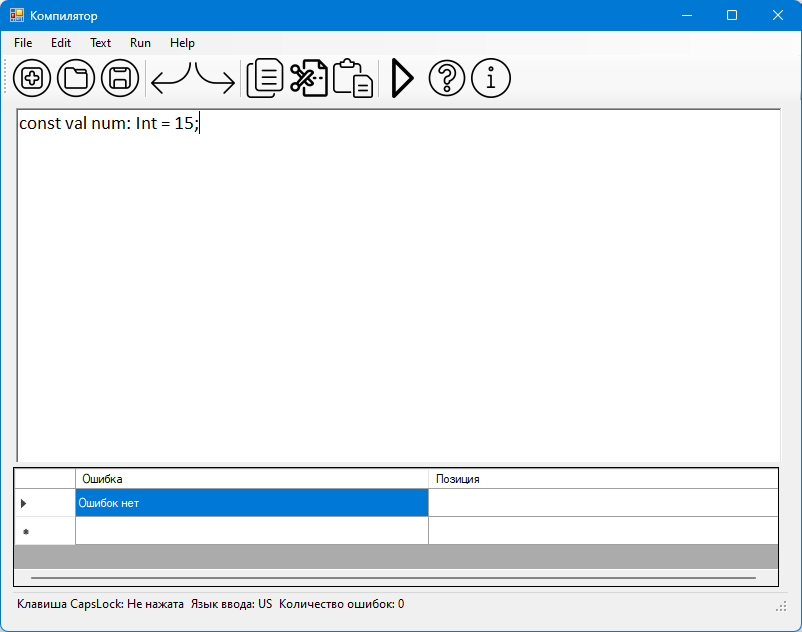
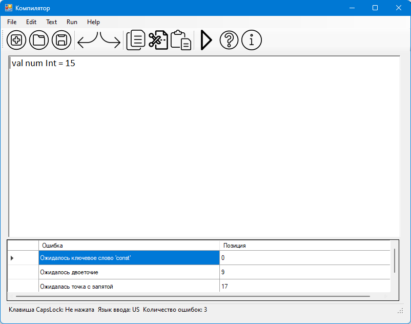

# Объявление целочисленной константы с инициализацией на языке Kotlin

## Примеры допустимых строк
```
const val a: int = 10;
const val b: int = 25;
```

## Разработанная грамматика
```
<DEF> -> 'const' <CONST>
<CONST> -> 'val' <VAL>
<VAL> -> <IDENT>
<IDENT> -> LETTER (DIGIT | LETTER | '_')* <COLON>
<COLON> -> ':' <TYPE>
<TYPE> -> 'int' <EQUALS>
<EQUALS> -> '=' <NUMBER>
<NUMBER> -> DIGIT+ <SEMICOLON>
<SEMICOLON> -> ';' <END>
```

## Граф конечного автомата


## Тестовые примеры


